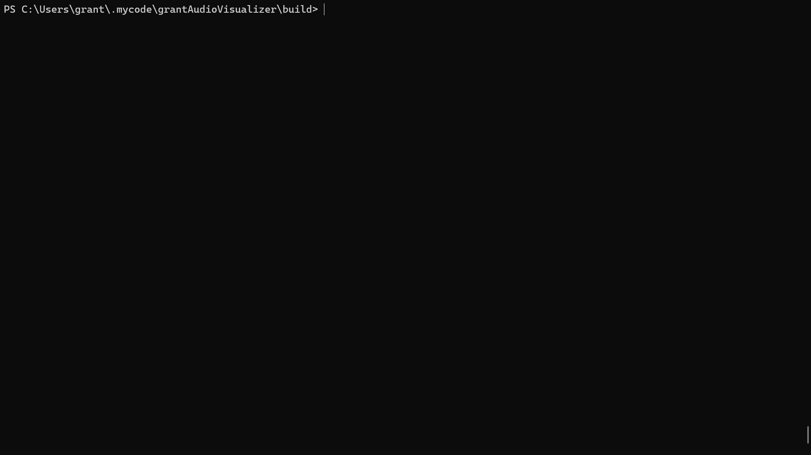

# Real-Time Audio Visualizer

A cross-platform audio visualization application that renders frequency spectrum analysis in real-time using OpenGL and PortAudio.


*32-band frequency spectrum visualization*

## Features

- **Real-time frequency analysis** using FFT (Fast Fourier Transform)
- **32 logarithmic frequency bands** (20Hz - 16kHz) for balanced visualization
- **GPU-accelerated rendering** with OpenGL 3.3 Core Profile
- **Multi-format support**: MP3, WAV, FLAC via libsndfile
- **Native file dialog** for easy audio file selection
- **Resizable window** with responsive visualization

## Technical Highlights

### Architecture
- **Thread-safe audio pipeline** using PortAudio's lock-free ring buffer
- **Multi-threaded design**: Audio playback runs on separate thread from analysis and rendering
- **Efficient GPU rendering**: Instanced drawing reduces 32 bars to a single draw call

### Audio Processing
- **FFT Size**: 1024 samples
- **Window Function**: Hanning window for reduced spectral leakage
- **Frequency Buckets**: 32 logarithmically-spaced bands
- **Analysis Rate**: ~60 Hz (synchronized with rendering)

### Rendering
- **Custom GLSL shaders** for vertex transformation and fragment coloring
- **Instanced rendering** for optimal performance
- **Real-time updates** at 60 FPS

## Dependencies

- **C++17** compiler
- **CMake** 3.16 or higher
- **vcpkg** for package management

### Libraries (via vcpkg)
- `glfw3` - Window and input management
- `glad` - OpenGL loader
- `portaudio` - Cross-platform audio I/O
- `libsndfile` - Audio file loading
- `fftw3f` - Fast Fourier Transform implementation
- `tinyfiledialogs` - Native file dialogs

## Building from Source

### Prerequisites

1. Install [vcpkg](https://github.com/microsoft/vcpkg):
```bash
git clone https://github.com/microsoft/vcpkg.git
cd vcpkg
./bootstrap-vcpkg.sh  # or bootstrap-vcpkg.bat on Windows
```

2. Install dependencies:
```bash
vcpkg install glfw3 glad portaudio libsndfile fftw3 tinyfiledialogs
```

### Compile

```bash
# Clone repository
git clone https://github.com/yourusername/audio-visualizer.git
cd audio-visualizer

# Create build directory
mkdir build && cd build

# Configure with CMake (adjust vcpkg path as needed)
cmake .. -DCMAKE_TOOLCHAIN_FILE=/path/to/vcpkg/scripts/buildsystems/vcpkg.cmake

# Build
cmake --build .
```

### Run

```bash
# From build directory
./AudioVisualizer  # Linux/macOS
AudioVisualizer.exe  # Windows
```

## Usage

1. Launch the application
2. Select an audio file using the file dialog
3. Watch the frequency spectrum visualize your audio in real-time!
4. Press **ESC** or close the window to exit

## How It Works

### Audio Pipeline

1. **Audio Loading**: `AudioLoader` uses libsndfile to decode audio files into raw PCM samples
2. **Buffering**: `AudioBuffer` maintains a thread-safe ring buffer for seamless playback
3. **Playback**: `AudioOutput` streams audio through PortAudio's callback system
4. **Analysis**: `AudioAnalyzer` performs FFT on audio data, converting time-domain samples to frequency spectrum
5. **Visualization**: `Visualizer` renders frequency buckets as dynamic bars using OpenGL

### FFT Analysis

- Applies **Hanning window** to reduce spectral leakage
- Computes **1024-point FFT** on audio samples
- Converts complex output to magnitude spectrum
- Groups magnitudes into **32 logarithmic buckets** for perceptually-balanced visualization
- Calculates **RMS** and **peak amplitude** for future features

### Rendering Pipeline

- **Vertex Shader**: Transforms single quad geometry into 32 positioned bars
- **Fragment Shader**: Applies solid color
- **Smoothing**: Exponential moving average prevents jittery motion

## Future Enhancements

- [ ] Live microphone input support
- [ ] Multiple visualization modes (waveform, circular spectrum, etc.)
- [ ] Dynamic color schemes based on amplitude/frequency
- [ ] Playback controls (play/pause, seek, volume)
- [ ] Audio effects (equalizer, reverb)
- [ ] Export visualization as video

## Author

**Grant LeRette-Kauffman**
- GitHub: [@grantjlk](https://github.com/grantjlk)
- Email: grantjlk@gmail.com
